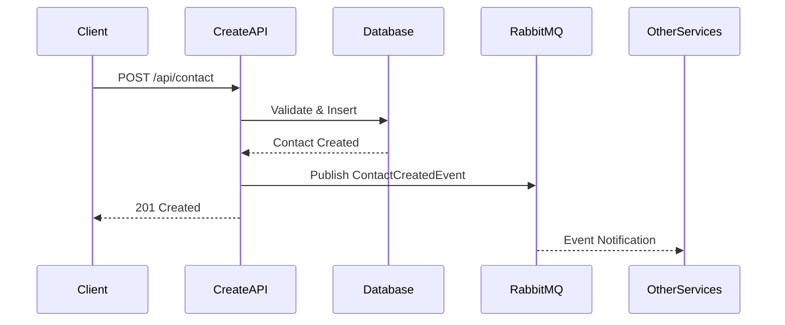
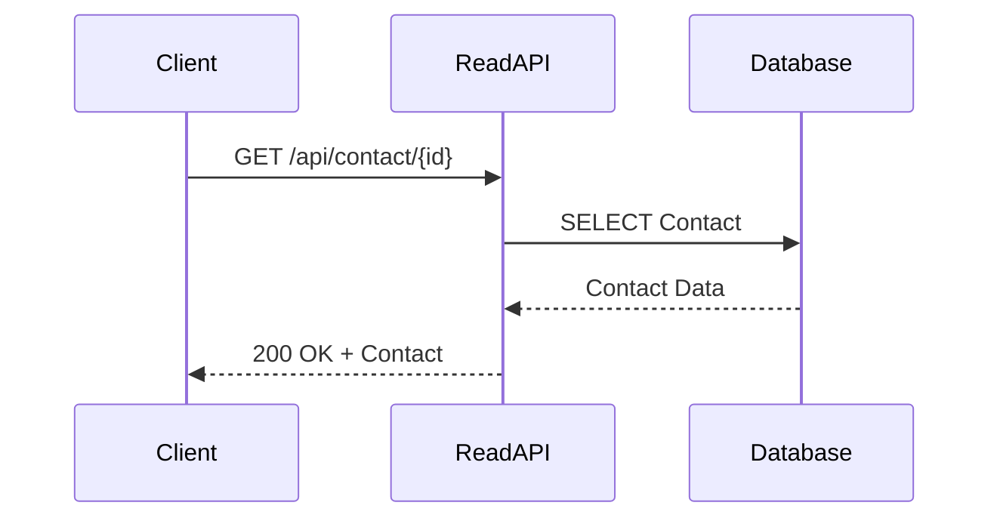
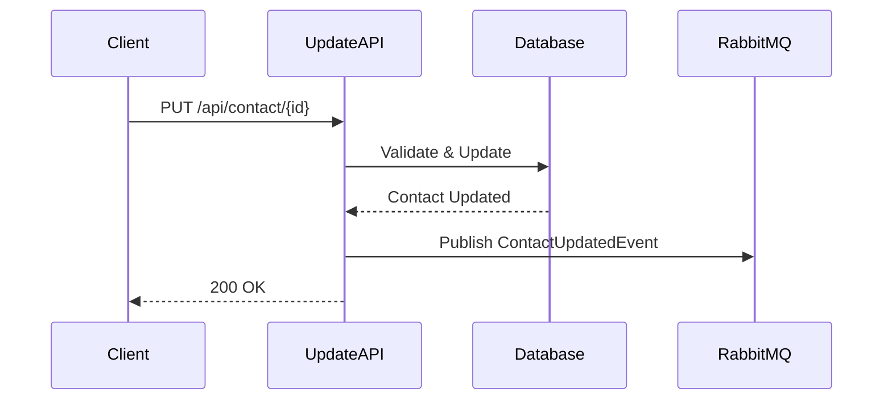
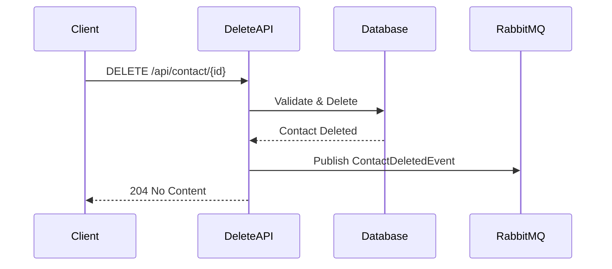

# Arquitetura do Sistema - Contact Microservices

## Visão Geral

O sistema Contact Microservices foi projetado seguindo os princípios de arquitetura de microserviços, onde cada operação CRUD (Create, Read, Update, Delete) é implementada como um serviço independente. Esta abordagem oferece benefícios significativos em termos de escalabilidade, manutenibilidade e isolamento de falhas.

## Princípios Arquiteturais

### 1. Separação de Responsabilidades

Cada microserviço tem uma responsabilidade específica e bem definida:

- **ContactCreate.API**: Responsável exclusivamente pela criação de novos contatos
- **ContactRead.API**: Focado na leitura e consulta de dados de contatos
- **ContactUpdate.API**: Gerencia atualizações de contatos existentes
- **ContactDelete.API**: Responsável pela exclusão de contatos

### 2. Comunicação Assíncrona

Os microserviços comunicam-se através de eventos assíncronos utilizando RabbitMQ como message broker. Isso garante:

- **Desacoplamento**: Serviços não dependem diretamente uns dos outros
- **Resiliência**: Falhas em um serviço não afetam diretamente outros
- **Escalabilidade**: Cada serviço pode ser escalado independentemente

### 3. Banco de Dados Compartilhado

Embora cada microserviço seja independente, eles compartilham o mesmo banco de dados SQL Server. Esta decisão foi tomada considerando:

- **Consistência de dados**: Evita problemas de sincronização entre bases
- **Simplicidade operacional**: Reduz a complexidade de gerenciamento
- **Performance**: Elimina a necessidade de comunicação entre bases

## Componentes da Arquitetura

### Camada de Apresentação (API Layer)

Cada microserviço expõe uma API REST independente:

```
┌─────────────────┐  ┌─────────────────┐  ┌─────────────────┐  ┌─────────────────┐
│ ContactCreate   │  │ ContactRead     │  │ ContactUpdate   │  │ ContactDelete   │
│ API             │  │ API             │  │ API             │  │ API             │
│ Port: 5001      │  │ Port: 5002      │  │ Port: 5003      │  │ Port: 5004      │
└─────────────────┘  └─────────────────┘  └─────────────────┘  └─────────────────┘
```

### Camada de Negócio (Business Layer)

Implementada nos controllers de cada API, contém:

- Validações de negócio específicas
- Orquestração de operações
- Publicação de eventos
- Tratamento de erros

### Camada de Dados (Data Layer)

Implementada através do projeto Infrastructure compartilhado:

- **Repository Pattern**: Abstração do acesso a dados
- **Dapper ORM**: Para performance otimizada
- **Connection Management**: Gerenciamento eficiente de conexões

### Camada de Mensageria (Messaging Layer)

Implementada no projeto Common:

- **Event Publishing**: Publicação de eventos de domínio
- **Message Routing**: Roteamento inteligente de mensagens
- **Error Handling**: Tratamento de falhas na comunicação

## Fluxo de Dados

### Criação de Contato



### Leitura de Contato



### Atualização de Contato



### Exclusão de Contato



## Eventos de Domínio

### ContactCreatedEvent

Publicado quando um novo contato é criado:

```json
{
  "eventType": "ContactCreated",
  "contactId": 123,
  "nome": "João Silva",
  "ddd": "11",
  "numeroCelular": "987654321",
  "email": "joao.silva@email.com",
  "timestamp": "2024-01-15T10:30:00Z"
}
```

### ContactUpdatedEvent

Publicado quando um contato é atualizado:

```json
{
  "eventType": "ContactUpdated",
  "contactId": 123,
  "nome": "João Santos",
  "ddd": "11",
  "numeroCelular": "987654321",
  "email": "joao.santos@email.com",
  "timestamp": "2024-01-15T11:45:00Z"
}
```

### ContactDeletedEvent

Publicado quando um contato é excluído:

```json
{
  "eventType": "ContactDeleted",
  "contactId": 123,
  "timestamp": "2024-01-15T12:00:00Z"
}
```

## Padrões Implementados

### Repository Pattern

Abstrai o acesso a dados e facilita testes:

```csharp
public interface IContactRepository
{
    Task<Contact?> GetByIdAsync(int id);
    Task<IEnumerable<Contact>> GetAllAsync(int page, int pageSize, string? search);
    Task<Contact> CreateAsync(Contact contact);
    Task<Contact> UpdateAsync(Contact contact);
    Task<bool> DeleteAsync(int id);
}
```

### Publisher Pattern

Facilita a comunicação assíncrona:

```csharp
public interface IMessagePublisher
{
    Task PublishAsync<T>(T message, string routingKey = "") where T : ContactEvent;
    void Publish<T>(T message, string routingKey = "") where T : ContactEvent;
}
```

### DTO Pattern

Separa modelos de domínio dos contratos de API:

```csharp
public class CreateContactDto
{
    public string Nome { get; set; }
    public string DDD { get; set; }
    public string NumeroCelular { get; set; }
    public string Email { get; set; }
}
```

## Considerações de Segurança

### Autenticação e Autorização

- **JWT Tokens**: Implementação futura para autenticação
- **API Keys**: Para comunicação entre serviços
- **HTTPS**: Obrigatório em produção

### Validação de Dados

- **Input Validation**: Validação rigorosa de entrada
- **SQL Injection Prevention**: Uso de parâmetros no Dapper
- **XSS Protection**: Sanitização de dados

### Auditoria

- **Event Logging**: Todos os eventos são logados
- **Change Tracking**: Rastreamento de mudanças
- **Access Logging**: Log de acessos às APIs

## Escalabilidade

### Horizontal Scaling

Cada microserviço pode ser escalado independentemente:

- **ContactRead.API**: Mais réplicas para alta demanda de leitura
- **ContactCreate.API**: Escalado conforme volume de criações
- **ContactUpdate.API**: Escalado para picos de atualizações
- **ContactDelete.API**: Menor número de réplicas (operação menos frequente)

### Vertical Scaling

Recursos podem ser ajustados por serviço:

```yaml
resources:
  requests:
    memory: "128Mi"
    cpu: "100m"
  limits:
    memory: "256Mi"
    cpu: "200m"
```

### Database Scaling

- **Read Replicas**: Para distribuir carga de leitura
- **Connection Pooling**: Otimização de conexões
- **Query Optimization**: Índices e otimizações

## Monitoramento e Observabilidade

### Health Checks

Cada serviço implementa health checks:

```csharp
app.MapHealthChecks("/api/contact/health");
```

### Métricas

Exposição de métricas para Prometheus:

- **Request Count**: Número de requisições
- **Response Time**: Tempo de resposta
- **Error Rate**: Taxa de erros
- **Database Connections**: Conexões ativas

### Logging

Logging estruturado com níveis apropriados:

```csharp
_logger.LogInformation("Contato criado com sucesso. ID: {Id}", contact.Id);
_logger.LogError(ex, "Erro ao criar contato: {Error}", ex.Message);
```

### Distributed Tracing

Preparado para implementação de tracing distribuído:

- **Correlation IDs**: Para rastrear requisições
- **Span Context**: Para contexto de operações
- **OpenTelemetry**: Framework de observabilidade

## Resiliência

### Circuit Breaker

Implementação futura para proteção contra falhas:

```csharp
// Exemplo de implementação com Polly
var circuitBreakerPolicy = Policy
    .Handle<Exception>()
    .CircuitBreakerAsync(3, TimeSpan.FromSeconds(30));
```

### Retry Policies

Políticas de retry para operações críticas:

```csharp
var retryPolicy = Policy
    .Handle<SqlException>()
    .WaitAndRetryAsync(3, retryAttempt => 
        TimeSpan.FromSeconds(Math.Pow(2, retryAttempt)));
```

### Timeout Handling

Timeouts configuráveis para operações:

```csharp
services.Configure<HttpClientOptions>(options =>
{
    options.Timeout = TimeSpan.FromSeconds(30);
});
```

## Deployment Architecture

### Containerização

Cada microserviço é containerizado independentemente:

```dockerfile
FROM mcr.microsoft.com/dotnet/aspnet:8.0 AS base
WORKDIR /app
EXPOSE 8080

FROM mcr.microsoft.com/dotnet/sdk:8.0 AS build
# Build steps...
```

### Orquestração Kubernetes

Deployment com configurações específicas:

```yaml
apiVersion: apps/v1
kind: Deployment
metadata:
  name: contact-create-api
spec:
  replicas: 2
  selector:
    matchLabels:
      app: contact-create-api
```

### Service Mesh (Futuro)

Preparado para implementação de service mesh:

- **Istio**: Para gerenciamento de tráfego
- **Linkerd**: Alternativa leve
- **Consul Connect**: Para service discovery

## Considerações de Performance

### Caching Strategy

Estratégias de cache por tipo de operação:

- **ContactRead.API**: Cache agressivo com TTL
- **ContactCreate.API**: Cache de validações
- **ContactUpdate.API**: Invalidação seletiva
- **ContactDelete.API**: Limpeza de cache

### Database Optimization

Otimizações específicas:

```sql
-- Índices para performance
CREATE INDEX IX_Contacts_Email ON Contacts(Email);
CREATE INDEX IX_Contacts_DDD_Numero ON Contacts(DDD, NumeroCelular);
CREATE INDEX IX_Contacts_DataCriacao ON Contacts(DataCriacao);
```

### Connection Management

Gerenciamento eficiente de conexões:

```csharp
services.Configure<SqlConnectionOptions>(options =>
{
    options.MaxPoolSize = 100;
    options.MinPoolSize = 5;
    options.ConnectionTimeout = 30;
});
```

## Evolução da Arquitetura

### Próximos Passos

1. **Event Sourcing**: Para auditoria completa
2. **CQRS**: Separação de comandos e consultas
3. **API Gateway**: Ponto único de entrada
4. **Service Discovery**: Descoberta automática de serviços
5. **Configuration Management**: Gerenciamento centralizado

### Migração Gradual

Estratégia para evolução sem interrupção:

1. **Strangler Fig Pattern**: Substituição gradual
2. **Feature Toggles**: Ativação controlada
3. **Blue-Green Deployment**: Deploy sem downtime
4. **Canary Releases**: Liberação gradual

Esta arquitetura fornece uma base sólida e escalável para o sistema de gerenciamento de contatos, permitindo evolução contínua e adaptação às necessidades futuras do negócio.

